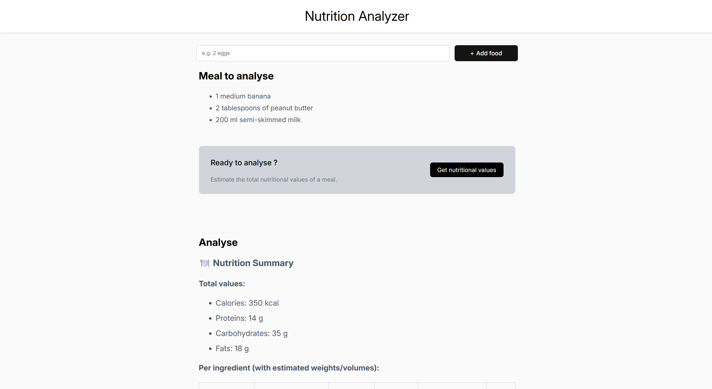
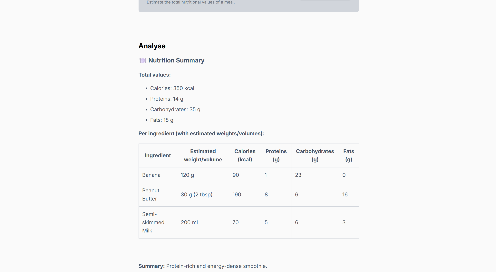

#  Nutrition Analyzer

A simple and interactive React application that estimates the **nutritional values** of a meal using AI-powered ingredient analysis.  
It allows users to enter a list of foods and get a **Markdown-formatted nutrition summary** rendered directly in the app.

---

##  Features

-  **AI-powered nutrition estimation** using the [Mistral API](https://docs.mistral.ai/api).
-  **Nutritional breakdown** per ingredient and total (calories, proteins, carbs, fats).
-  **Automatic language detection** — supports **English** and **French**.
-  **Live Markdown rendering** with tables and formatted summaries.
-  Modular and clean React components (`Main`, `FoodList`, `Summary`).
-  Smart validation: warns if input is not edible food items.

---

##  Tech Stack

- **React + Vite**
- **React Markdown** (`react-markdown`, `remark-gfm`)
- **Mistral AI SDK** (`@mistralai/mistralai`)

---

##  Setup Instructions

- Clone the repository
- Install dependencies run npm install
- Create a .env file at the root of your project and add your [Mistral API key](https://admin.mistral.ai/organization/api-keys)
VITE_MISTRAL_API_KEY=your_api_key_here
- Run the app locally
npm run dev
- Then open your browser at: [http://localhost:5173](http://localhost:5173)

---

## How It Works

- Enter one or more food items (e.g. 1 banana, 2 eggs, 200 ml milk).

- Click "Get nutritional values".

- The app sends the ingredient list to Mistral’s AI model.

- The AI estimates quantities and nutritional data.

- The result is displayed as a formatted Markdown summary with:

    - Ingredient-by-ingredient breakdown

    - Total calories, proteins, carbs, fats

    - Quick summary (e.g. "Protein-rich and energy-dense meal.")
 
---

  
  

